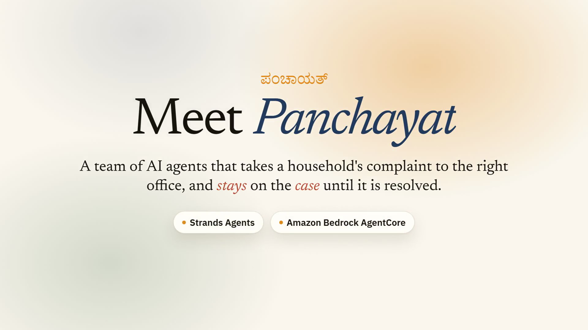
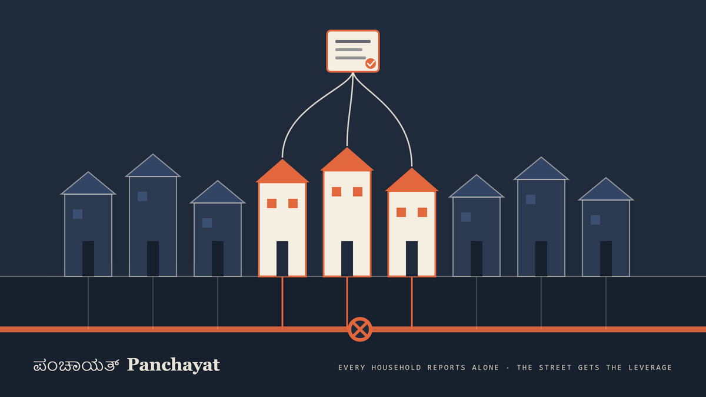
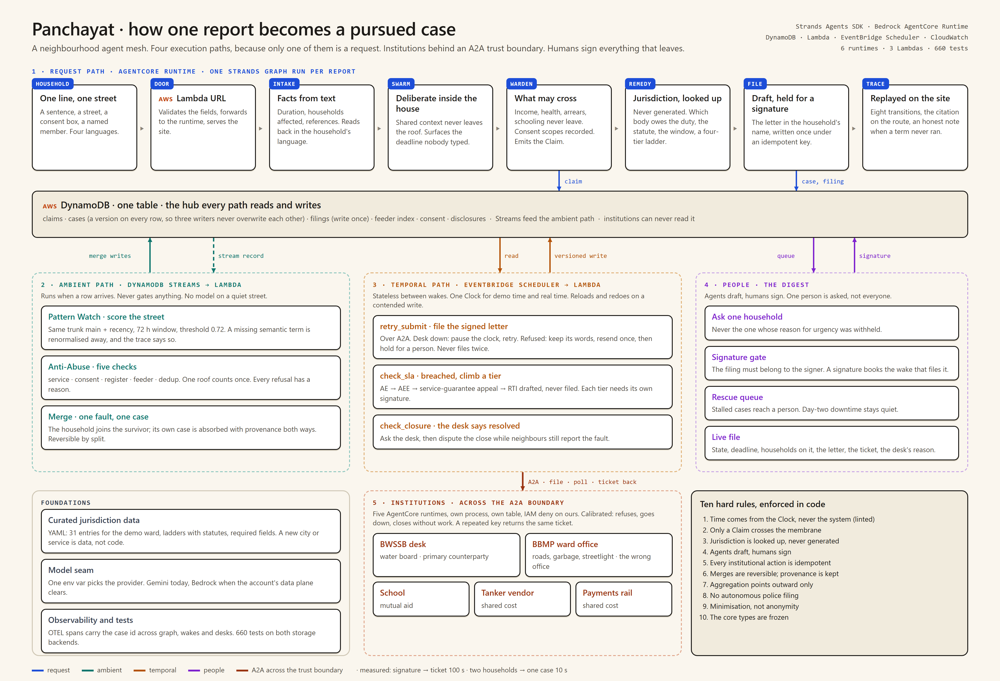
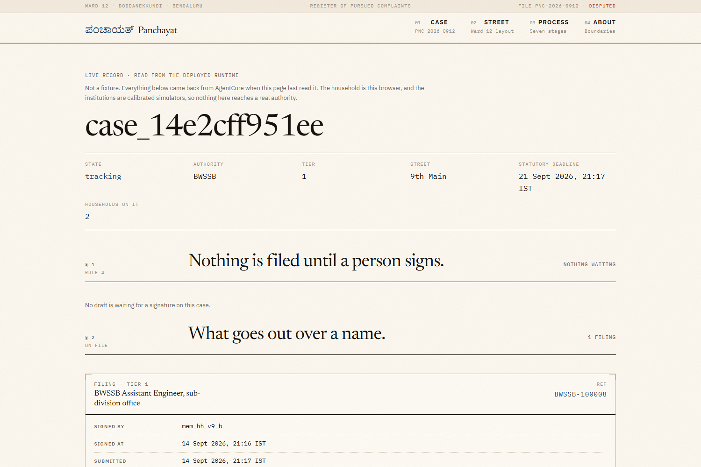
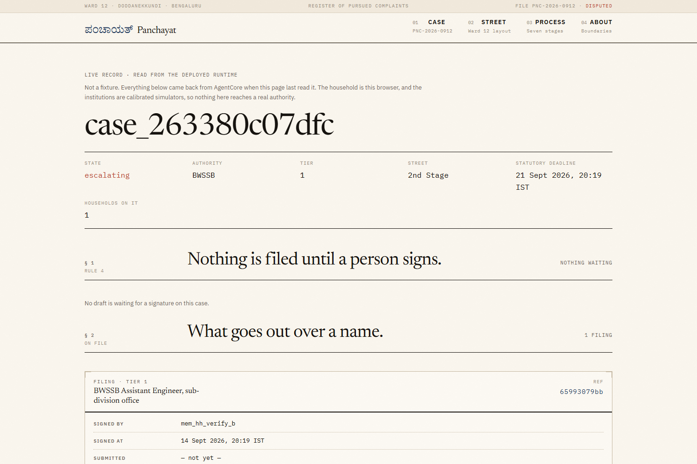

<p align="center">
  
</p>

<h1 align="center">Panchayat</h1>

<p align="center"><b>Every household reports alone. The street gets the leverage.</b></p>

<p align="center">
  A neighbourhood agent mesh that takes one household's complaint to the right office and stays on the case until it is resolved.<br>
  Built on the <a href="https://strandsagents.com">Strands Agents SDK</a>, deployed on <a href="https://aws.amazon.com/bedrock/agentcore/">Amazon Bedrock AgentCore</a>.<br>
  AWS <i>Agents for Humans</i> hackathon, Good Neighbor track.
</p>

<p align="center">
  <a href="https://pcvsce443opuo4ma4wayk4bogi0btrkj.lambda-url.ap-south-1.on.aws/"><b>Live site</b></a> ·
  <a href="https://youtu.be/8PZwcGsHFJ8"><b>Demo video</b></a> ·
  <a href="https://pcvsce443opuo4ma4wayk4bogi0btrkj.lambda-url.ap-south-1.on.aws/live/case_14e2cff951ee"><b>A real case with a ticket</b></a> ·
  <a href="docs/EXPLAINER.md"><b>Plain-language explainer</b></a>
</p>

---

## The problem

Every neighbourhood already knows when something breaks. The group chat knows inside fifteen minutes. What nobody has is the stamina for what comes after: file against the right body and not the wrong one, keep a statutory clock running for weeks, notice the day it breaches, and climb to the next authority with the whole record intact. Households do this alone, and institutions count on them giving up. Complaints get marked resolved with no work done. The same fault gets closed and reopened for months.

Panchayat is the neighbour who never gives up.

## What it does

One household types one line. Panchayat turns it into a pursued case.

1. **Finds the authority that owes the duty, with the statute that says so.** Jurisdiction is looked up in a curated table, never generated by a model. Every routing decision carries a citation. An unknown street gets a question, not a guess.
2. **Drafts the complaint in the household's name and waits for a real signature.** Agents draft, humans sign. Nothing goes to a public body without a named person approving the exact words.
3. **Files it and starts the clock.** The signed letter reaches the institution over A2A and comes back with a ticket number. Measured on the deployed stack: **100 seconds from signature to ticket.**
4. **Keeps watching after everyone else has stopped.** A Watchdog wakes on every deadline, rides out an office that is down, and escalates a tier the day a window breaches. A desk that refuses gets one resend; then the household sees the desk's own words.
5. **Turns neighbours into a collective, with consent.** A second household on the same line reporting the same fault, and agreeing to be counted, becomes one case with two households behind it. **Ten seconds, measured.** Reversible, provenance kept, and nothing about the inside of a house ever leaves it.

Twelve households reporting one outage stop being twelve tickets an office can close one by one. They become one file with twelve names on it and a clock the office cannot ignore.

<p align="center">
  
</p>

## Architecture

A pursued complaint is not a request. It is four different kinds of work, so Panchayat runs four execution paths. A Graph invocation cannot wait seven days or react to a row arriving, and we did not try to make it.

<p align="center">
  
</p>

| Path | Trigger | Runs on |
|---|---|---|
| **Request** | a household reports | AgentCore Runtime, one Strands `Graph` |
| **Ambient** | a claim row arrives | Lambda on DynamoDB Streams |
| **Temporal** | a deadline passes | EventBridge Scheduler to Lambda |
| **Institutions** | called over A2A | five separate AgentCore runtimes, their own state |

**The request path** is eight agents in one graph: intake, a household deliberation swarm, a privacy warden that decides what may leave the house, a grounded jurisdiction lookup, drafting, and a trace the site replays live.

**The ambient path** scores every new claim against its neighbours on topology and recency. It never gates anything; on a quiet street it runs no model for weeks. When two households cross threshold, and both consented, the survivor absorbs the other case with provenance both ways.

**The temporal path** is a Watchdog that holds no state between wakes. One clock abstraction runs the same code as a compressed demo and as a real week.

**The institutions** are five simulated desks, each its own AgentCore runtime reached over A2A, each with its own table and an IAM role explicitly denied access to ours. The trust boundary is enforced by the platform, not by politeness. The proof is a ticket number that exists in the desk's own table, which our role cannot read, and in ours.

Underneath: one DynamoDB table with a single GSI, versioned case rows so three concurrent writers never overwrite one another, write-once filings so a retrying Watchdog never files twice, and 660 tests that run unchanged against the in-memory store and the real DynamoDB code path.

## What a judge sees

<table>
<tr>
<td width="50%"><br><sub><b>A live file.</b> Two households on it, signed by a named member, ticket <code>BWSSB-100008</code> issued by the desk runtime, statutory deadline running.</sub></td>
<td width="50%"><br><sub><b>A refusal, recorded.</b> The desk said no twice. The household sees the reason and that a person now has to act. Nothing is resent blindly.</sub></td>
</tr>
</table>

## Beyond the demo

The demo follows one service in one ward, because that is where the curated jurisdiction table has entries. Everything the table feeds is already general; nothing in the spine knows it is about water.

- **Service-agnostic spine.** Six services in the type (water, power, sewage, garbage, roads, streetlight). Routing is a lookup on (service, street). The ward-office desk already accepts five of them. A second service is a YAML ladder with citations.
- **Jurisdiction with teeth.** Each entry names the body that owes the duty and the one that does not, the statutory window, the fields the office refuses without, and a four-tier ladder ending in an RTI the system drafts and never files.
- **Consent as a gate.** Four scopes (file individually, join a collective, be listed publicly, spend money), revocable, with a disclosure ledger. The merge counts a household only when it said yes. Income, health, arrears and schooling never cross the membrane.
- **Deliberation inside the house.** A household is a swarm, not a form. It surfaces the deadline nobody typed. Intake and the Digest speak English, Kannada, Hindi and Tamil.
- **A Watchdog for the real world.** Four wakes: statutory check, closure check, unsigned-draft expiry, resend. It disputes a closure marked resolved while neighbours still report the fault, after asking the desk itself. Never files twice. Never files unsigned. Every tier needs its own signature.
- **The street as evidence.** Corroboration counts distinct households, never claims. Recurrence counts prior failures on the same main. Absorbed cases stop counting as history, so one outage never inflates itself.
- **Institutions that behave like institutions.** Calibrated rates for refusing on a pretext, being unreachable, and closing without doing the work, with randomness checkpointed so a retry meets the same office.

## Ten hard rules

Written before the code, enforced in the code. The linter checks the first.

1. Nothing calls `datetime.utcnow()`. Time comes from the Clock.
2. A household's position never crosses the membrane. Only a Claim does.
3. Jurisdiction is looked up, never generated. Every route carries a citation.
4. Agents draft, humans sign.
5. Every institutional action is idempotent.
6. Merges are reversible. Provenance lives in `case.merged_from`.
7. Aggregation points outward only, never at a person or household.
8. No autonomous police filing. Read, track, advise.
9. Minimisation, not anonymity. Income, health, arrears and schooling never cross.
10. `core/types.py` is frozen. Changes are a group call.

## Run it

```bash
python -m venv .venv && .venv\Scripts\activate      # Windows; source .venv/bin/activate elsewhere
pip install -r requirements.txt
cp .env.example .env                                 # GEMINI_API_KEY lives here and nowhere else

pytest                                               # in-memory backend, no AWS, ~50 s
ruff check .                                         # the clock rule is a lint rule
```

The same suite runs against the DynamoDB code path with a local endpoint. No Java or Docker needed; `moto` in server mode is enough:

```bash
pip install "moto[server]"
python -m moto.server -p 5055 &
export AWS_ACCESS_KEY_ID=testing AWS_SECRET_ACCESS_KEY=testing AWS_DEFAULT_REGION=us-east-1
PANCHAYAT_DDB_ENDPOINT=http://127.0.0.1:5055 python scripts/create_table.py
PANCHAYAT_BACKEND=dynamodb PANCHAYAT_DDB_ENDPOINT=http://127.0.0.1:5055 pytest
```

Use `127.0.0.1`, not `localhost`: on Windows `localhost` tries IPv6 first and every request costs a second. `reset()` refuses to run against anything but a local endpoint, so the real table is never in reach.

Evaluation harnesses, all offline:

```bash
python -m eval.routing_accuracy     # does the curated table route the corpus to the right body
python -m eval.tau_sweep            # where the clustering threshold sits and why
python -m eval.density_curve        # how the collective's odds move with household count
```

## Deploy it

Six AgentCore runtimes, three Lambdas, one scheduler role, two tables. Every step is a script and every trap is written down in [`docs/deploy/SETUP.md`](docs/deploy/SETUP.md).

| Target | Script |
|---|---|
| the request-path runtime | `scripts/deploy_runtime.ps1` |
| the five institution desks | `scripts/deploy_desk.ps1 -Desk bwssb,ward,school,vendor,payments` |
| the Watchdog and ambient Lambdas | `scripts/deploy_lambdas.sh` |
| the site and its door | `scripts/deploy_web.ps1` |
| prove the desks answer | `python scripts/smoke_desks.py` |

## Repository

```
agents/         the eight agents: intake, household, warden, remedy, pattern_watch, anti_abuse, watchdog, digest
graph/          the request path, the trace, the read API, observability
core/           frozen types, the clock, both storage backends, scoring, the model seam
handlers/       the three Lambdas: web door, ambient, temporal
institutions/   the A2A desks, their client, their protocol, calibrated profiles
data/           curated jurisdiction for the demo ward, synthetic corpus
eval/           routing accuracy, tau sweep, density curve
web/            the React site
tests/          660 tests, both backends
docs/           explainer, deploy guide, handoffs, per-person briefs
```

- [`docs/EXPLAINER.md`](docs/EXPLAINER.md): the whole project in plain language.
- [`docs/demo/docket.html`](docs/demo/docket.html): forty questions a judge might ask, each with a verdict and the file that proves it.
- [`CLAUDE.md`](CLAUDE.md): the shared context every contributor reads first, including the rules that are expensive to get wrong.
- [`STATUS.md`](STATUS.md): what has landed, by lane, with dates.

## Where it stands

The whole institutional tail runs on AWS end to end. The demo covers one ward and one service, with simulated institutions and no login. Adding a city or a service is data: a jurisdiction table, an escalation ladder and a desk profile, all YAML the agents read.

Model calls run behind a one-line seam. The account's Bedrock model data plane is locked behind a support case, so today the seam points at Gemini; it flips to Bedrock inference profiles the hour the case clears. AgentCore itself was never blocked, and every runtime in this repo is on it.

**What's next:** roads and potholes as the second service on the same spine, verified identity through AgentCore Identity so a street cannot be faked from one browser, and the two tails designed but not built: mutual aid through the school desk, shared cost through the tanker and payments desks.

## Team

| Who | Lane | GitHub |
|---|---|---|
| Ali | platform, lead | [@LycanAlan](https://github.com/LycanAlan) |
| Kartik | data, mesh | [@ShipWithKartik](https://github.com/ShipWithKartik) |
| Alakshendra | institutions | [@AlakshendraB](https://github.com/AlakshendraB) |
| Raghav | household, time | [@Ragh234](https://github.com/Ragh234) |

One brief per person in [`docs/team/`](docs/team/).
